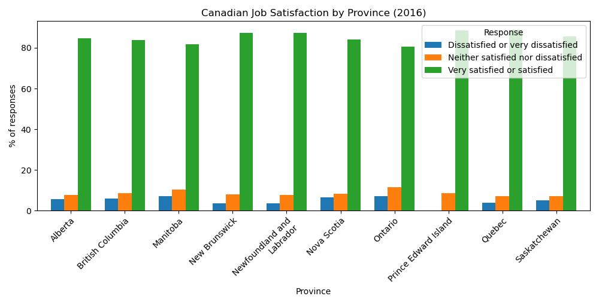
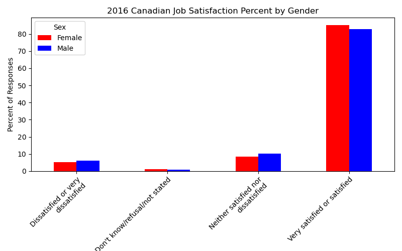

# UofWProject1

1.	Are there trends in job satisfaction geographically? 

    What we have found in the provincial data is a rather weak relationship between province and satisfaction level.

    
    Satisfaction percentages by province
    
    
    Doing some statistical analysis to verify if this data set is to be met with caution, we have the following:
    The actual reported numbers in the values column for "persons" counts, as they are by units of 1000s, represent a little over half the population of Canade as of 2016, thus population representation is not something to worry
    The way data is represented as bulk values, as well as the fact that there are only 3 qualitative responses, indicate that there is not much that can be done from a regressive state of analysis
    Due to previous point mentioned, normality and homogeneity of variance (independence in this case) would be hard to find, yet we decided to test them, at least on one the first variable set.

    With all that said, a hypothesis test was done twice on these variables. The null hypothesis is this: the various geographic divisions of Canada have no bearing on job satisfaction levels. The p-values tested on an alpha of 0.05 with the anova one-way test have shown both the general response and the responses of only satifaction are statistically significant, being both less than 0.001, thus initially there would seem to be an impact on data. 
    These would be the following: British Columbia on Prince Edward Island: New Brunswick on Ontario, Newfoundland and Labrador on Ontario, Ontario on Prince Edward Island, and Ontario on Saskatchewan. While the sheer number of appearances Ontario has in significance, it does not compare to the majority of the data. Aside from this, the appearances are to be taken with caution as there is not normality present in this data set.

    The implications of this are very diverse, but two come to mind. One is that Canada is politically unified enough that no one political region has a significant benefit or hinderance to the others in relation to the labor force. The second is that there is a generally steady flow of employment opportunities present throughout Canada, as the satisfaction levels are all greater than 70% but less than 95%.

2.	Is there a correlation between gender and job satisfaction?
   
   The level of job satisfaction for each response is fairly consistent between male and female respondents.    For the response selection of "Very satisfied or satisfied" approximately 320K more males were in that category, however from a percentage comparison females were slightly higer at 85.2% compared to males at 82.8%.
  	There were no observable trends correlating if respondents were male or female

      
      2016 Canadian Job Satisfaction Percent by Gender

4.	Does age have an impact on job satisfaction?
   
    - No, age group does not have a significant impact on job satisfaction. We were able to draw this conclusion by first cleaning up the data to put into a bar graph with each satisfaction level as a column for each age group category.
  	
  	- From there I tried to calculate the absolute difference between the satisfaction and dissatisfaction columns for each age group. The absolute difference did not offer any additional insights however it led me to the next test which was relative change.
  	
  	- To calculate the relative change for each age group I subtracted the satisfaction column from the dissatisfaction column, then divided that by the satisfaction level and multiplied by 100. This graph allowed us to visually see that the percent difference between the satisfaction levels was not significantly different enough to correlate to a trend between job satisfaction and age group

Other reference and information:
Statistics Canada
https://www.statcan.gc.ca/en/start

Job satisfaction by age group and sex, Canada, provinces and regions (x1,000)
note1: Source: Statistics Canada, General Social Survey, 2016, Canadians at work and home.
note2: The question JSR_Q02 about level of job satisfaction was asked to employed workers only. Please see the questionnaire for more details.

https://www150.statcan.gc.ca/t1/tbl1/en/tv.action?pid=2210011101

General Social Survey(GSS): Canadians at Work and Home
Data released - 11/14/17
- GSS surveys every 5 years
- GSS survey objectives are to gather data on trends to monitor changes in living conditions and well being, and provide information on specific social policy issues
- one eligible person (non-institutionalized person 15 years old or older) is randomly selected from sampled household
- Canadians at Work and Home survey in 2016 was the first time conductive; 50.8 response rate

Goal was to uncover trends in job satisfaction throughout Canada
We examined factors - geographically, gender and age group

36.11 million (2016) Canada Population

CONCLUSION
After data clean-up and review of analysis, we concluded that with the areas we focused on there were not discernable differences between Job Satisfaction responses.
We believe to further investigate job satisfaction, whether Canada or other countries geographies, we need to find additional data considering other factors.

Responses - data limitations
- several responses, when broken down by age group or geographically, were surpressed and accompanied in dataset by symbol "E: use with caution" or replaced by "F: too unreliable to be published".
- when rolled up to categories inclusive of all subgroups, some additional results were available

